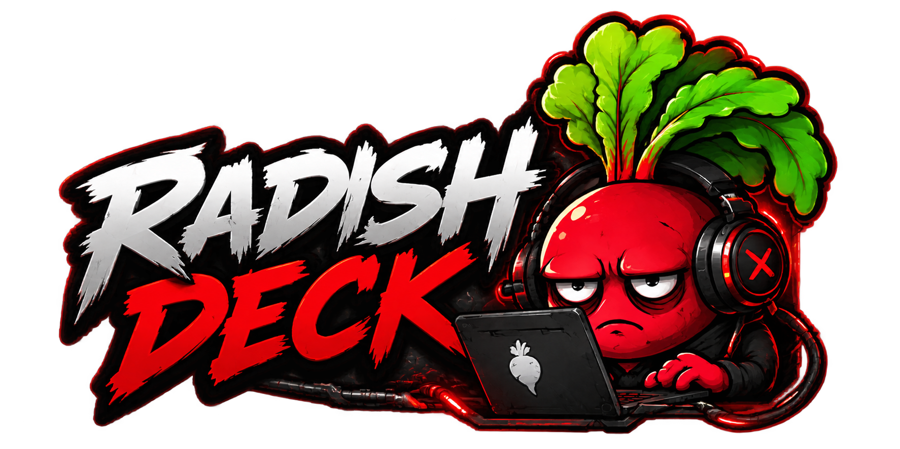

# Radish Deck

<p align="center">
  
</p>

<p align="center">
  🇷🇺 Русский · 🇬🇧 English
</p>

---

------------------------------------------------------------------------

# 🇷🇺 Русский

## Универсальный конструктор персональных пультов управления

**Radish Deck** --- система создания персональных панелей управления.

Пользователь сам собирает свой Deck под свои задачи:

-   управление компьютером;
-   запуск приложений;
-   управление сервисами;
-   мониторинг системы;
-   автоматизация;
-   подключение удалённых узлов.

**Текущая версия:** `0.2.2-alpha`


Проект находится в активной разработке.

------------------------------------------------------------------------

# Главная идея

> RadishDeck --- это не готовый пульт. Это конструктор пультов.

Пользователь создаёт собственные интерфейсы управления:

-   Gaming Deck;
-   Admin Deck;
-   Home Deck;
-   Work Deck.

------------------------------------------------------------------------

# Архитектура

    RadishDeck.Desktop
            |
            | Конструктор
            |
            v

    RadishDeck.Server
            |
            | Центр управления
            |
            +-------------+
            |             |
            v             v

          Web          Mobile
        (пульт)       (пульт)

------------------------------------------------------------------------

# Компоненты

## RadishDeck.Desktop

Desktop --- это только конструктор.

Используется для:

-   создания страниц;
-   добавления элементов;
-   настройки внешнего вида;
-   назначения действий;
-   редактирования Deck.

Desktop не является ежедневным пультом.

------------------------------------------------------------------------

## RadishDeck.Server

Server --- центральный компонент системы.

Планируется:

-   хранение Deck;
-   выполнение Actions;
-   API;
-   состояние устройств;
-   управление узлами.

------------------------------------------------------------------------

## Web Client

Web --- будущий рабочий пульт.

Открывается:

-   на компьютере;
-   планшете;
-   телефоне.

------------------------------------------------------------------------

## Mobile Client

Будущий клиент.

Использует тот же API, что и Web.

------------------------------------------------------------------------

# Что реализовано в 0.2.0-alpha

-   Desktop приложение;
-   Server приложение;
-   Server Status API;
-   Server lifecycle control;
-   Core модели;
-   Deck Editor;
-   Pages;
-   Elements;
-   Action Registry;
-   Action Dispatcher;
-   JSON хранение Deck.

Доступные действия:

-   `server.start`
-   `server.stop`
-   `url.open`
-   `process.start`

------------------------------------------------------------------------

# План 0.2.1-alpha

## Action System

-   `process.start`;
-   запуск программ через действия;
-   параметры запуска.

## Server

-   Server-owned Deck;
-   API работы с Deck;
-   выполнение действий через Server.

## Web

-   первый Web Control Panel;
-   отображение Deck;
-   выполнение действий через API.

## Desktop

-   подготовка WebView2 Preview;
-   единый HTML Renderer.

------------------------------------------------------------------------

# Главный принцип

## Один Renderer

Desktop Preview и Web должны использовать один HTML интерфейс.

Не делать отдельный WPF интерфейс и отдельный Web интерфейс.

------------------------------------------------------------------------

# Технологии

-   C#
-   .NET
-   WPF
-   ASP.NET Core
-   REST API
-   WebView2
-   HTML / CSS / JS

------------------------------------------------------------------------

# Документация

    docs/

    VISION.md
    ARCHITECTURE.md
    DEVELOPMENT_PLAN.md
    DESIGNER.md
    CODEX_CONTEXT.md
    DEVELOPMENT_RULES.md
    BUILD.md

------------------------------------------------------------------------

------------------------------------------------------------------------

# 🇬🇧 English

## Universal personal control panel constructor

**Radish Deck** is a system for creating personal control panels.

Users build their own Deck for their own needs:

-   computer control;
-   application launching;
-   service management;
-   system monitoring;
-   automation;
-   remote node connection.

**Current version:** `0.2.2-alpha`


The project is under active development.

------------------------------------------------------------------------

# Core Idea

> RadishDeck is not a ready-made panel. It is a panel constructor.

Users create their own interfaces:

-   Gaming Deck;
-   Admin Deck;
-   Home Deck;
-   Work Deck.

------------------------------------------------------------------------

# Architecture

    RadishDeck.Desktop
            |
            | Designer
            |
            v

    RadishDeck.Server
            |
            | Control center
            |
            +-------------+
            |             |
            v             v

          Web          Mobile
        (Panel)       (Panel)

------------------------------------------------------------------------

# Components

## RadishDeck.Desktop

Desktop is the designer only.

Used for:

-   creating pages;
-   adding elements;
-   styling;
-   assigning actions;
-   editing Deck.

------------------------------------------------------------------------

## RadishDeck.Server

Server is the central system component.

Planned responsibilities:

-   Deck storage;
-   Action execution;
-   API;
-   device state;
-   node management.

------------------------------------------------------------------------

## Web Client

Future working control panel.

Available from:

-   desktop;
-   tablet;
-   phone.

------------------------------------------------------------------------

## Mobile Client

Future client.

Uses the same API as Web.

------------------------------------------------------------------------

# Implemented in 0.2.0-alpha

-   Desktop application;
-   Server application;
-   Server Status API;
-   Server lifecycle control;
-   Core models;
-   Deck Editor;
-   Pages;
-   Elements;
-   Action Registry;
-   Action Dispatcher;
-   JSON Deck storage.

Available actions:

-   `server.start`
-   `server.stop`
-   `url.open`

------------------------------------------------------------------------

# 0.2.1-alpha Roadmap

## Action System

-   `process.start`;
-   application launch actions;
-   launch parameters.

## Server

-   Server-owned Deck;
-   Deck API;
-   server-side action execution.

## Web

-   first Web Control Panel;
-   Deck rendering;
-   API actions.

## Desktop

-   WebView2 Preview preparation;
-   single HTML Renderer.

------------------------------------------------------------------------

# Principle

## One Renderer

Desktop Preview and Web should use the same HTML interface.

No separate WPF UI and Web UI.

------------------------------------------------------------------------

# Technology Stack

-   C#
-   .NET
-   WPF
-   ASP.NET Core
-   REST API
-   WebView2
-   HTML / CSS / JS

------------------------------------------------------------------------

# Documentation

    docs/

    VISION.md
    ARCHITECTURE.md
    DEVELOPMENT_PLAN.md
    DESIGNER.md
    CODEX_CONTEXT.md
    DEVELOPMENT_RULES.md
    BUILD.md

## RadishDeck 0.4.0-alpha

Stage 1–2 подготавливают переход от Grid-only Button модели к архитектуре
Canvas Designer. Добавлены Core-модели CanvasProfile, DeviceProfile и секции
Element V2: Layout, Content, Appearance, Behavior, Action.

В существующий Element подключены nullable-секции V2. Identity пока остаётся
плоской группой Id, Name, Type. Старые Grid-поля, ActionId, Url и Color сохранены.
Отсутствующие V2-секции не записываются в JSON; существующие проекты открываются
без миграции. Заданные секции сериализуются как дополнительные данные.

Renderer Contract подготовлен на уровне Core.
Desktop UI и Web Runtime по-прежнему сохраняют совместимость со старыми полями.

Stage 4 добавляет первый ощутимый Designer Preview: Desktop показывает
Element V2 Button на Canvas в координатах X/Y, позволяет выбрать элемент,
перетащить его мышью и изменить координаты в панели свойств. Это MVP WPF
адаптера Renderer Contract; Web Runtime и формат Deck остаются прежними.

## Current Stage 5 status

The Desktop application now uses WPF as its host and WebView2 for the local RadishDeck UI. Local assets are under `src/RadishDeck.Desktop/Web`; the shell includes Главная, Редактор, Логи, Клиенты and Настройки. The Designer prototype uses a logical 1920×1080 Canvas, Button selection and drag, clamping, a structured C#↔JavaScript bridge and JSON persistence. Server Start/Stop/Restart, bind-address selection, port validation, actual URL, copy/open controls remain available in the shell. The browser Web Runtime is a separate Server-served surface.

Run the Desktop shell with:

```powershell
dotnet run --project src/RadishDeck.Desktop/RadishDeck.Desktop.csproj
```

See [docs/ARCHITECTURE.md](docs/ARCHITECTURE.md) for the current host/bridge model and [docs/DESIGNER.md](docs/DESIGNER.md) for the Designer direction. The images in `assets/image concept/` remain approved visual references for future UI stages; they are not a claim of pixel-perfect Stage 5 completion.
